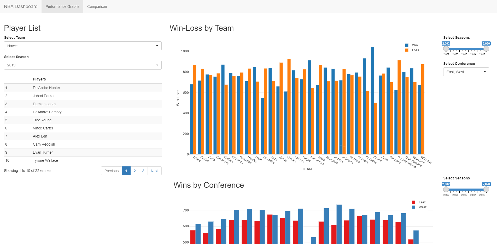
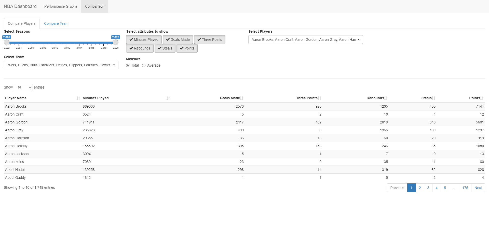

# NBA Dashboard

This is a dashboard develpoed with R programming language and Shiny framework. It visualizes and compares different statistics about NBA teams and players.

A live version of the dashboard can be found [here](https://shiny.wahidkhan.me/app_direct/nba).